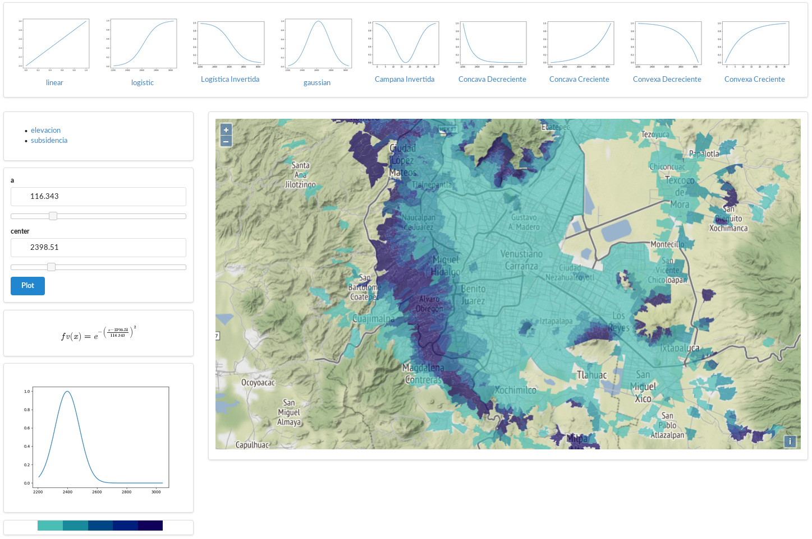

# Geo Value Function

Web front-end for value-function calibration.

## How to run it

Install dependencies:

	$ pip install -r requirements

Start development server:

	$ python server.py

Then point your browser to http://localhost:5000/

This software may also be running here: http://gvf.magrat.mine.nu/
